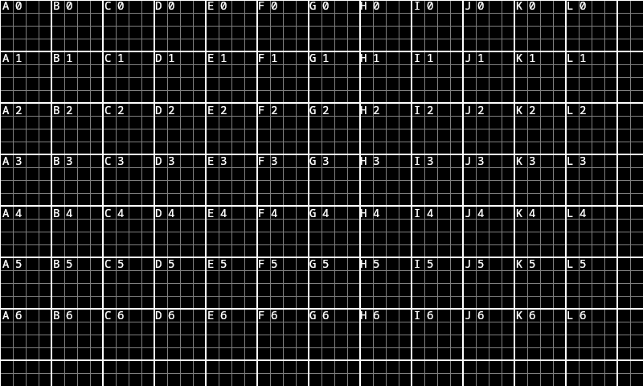
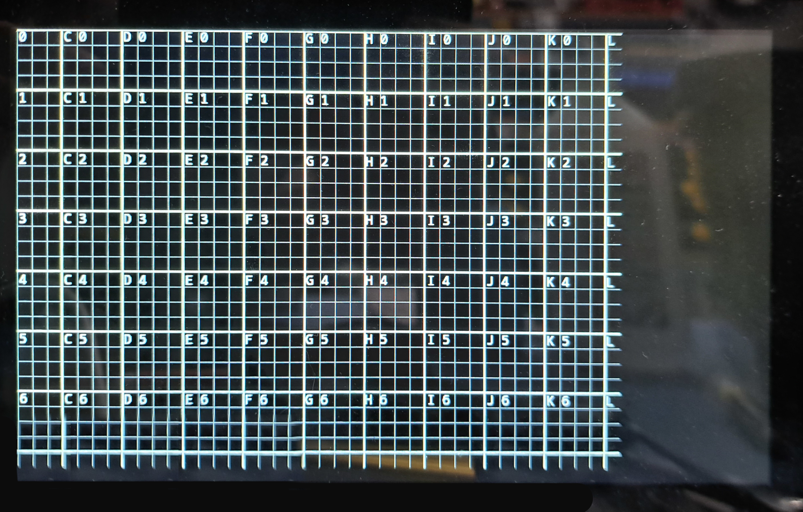

# Boot Screen

The boot screen of the device is specified by the `./resources/boot_screen.tga` file. This file format and encoding is required by the Raspberry Pi bootloader, however is not easily modifiable by most image editors (most image editors do not respect the color depth).

The `./resources/boot_screen.xcf` file is the source file for the boot screen. This can be edited using GIMP. After modifications to this file have been made, the image must be exported to a `.png` file.

After acquiring this `.png` file, it can be converted to a `.tga` file using Imagemagick.

```
magick resources/boot_screen.png \
  -resize 800x480 \
  -background black \
  -gravity center \
  -extent 800x480 \
  -depth 8 \
  -colors 224 \
  -type truecolor \
  resources/boot_screen.tga
```

This file will be used next time an OS image is generated.

## Resolution

Due to a bug in either the DART's display or the Linux kernel, the boot screen image does not render correctly during the system's boot. Rather, the image is both off-cented and cropped. To accomodate for this, the boot screen must be kept within the `usable_area` layer of the `.xcf` file.

For example, this grid:



is mapped to:

