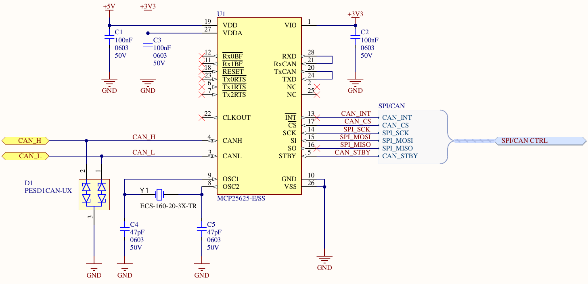
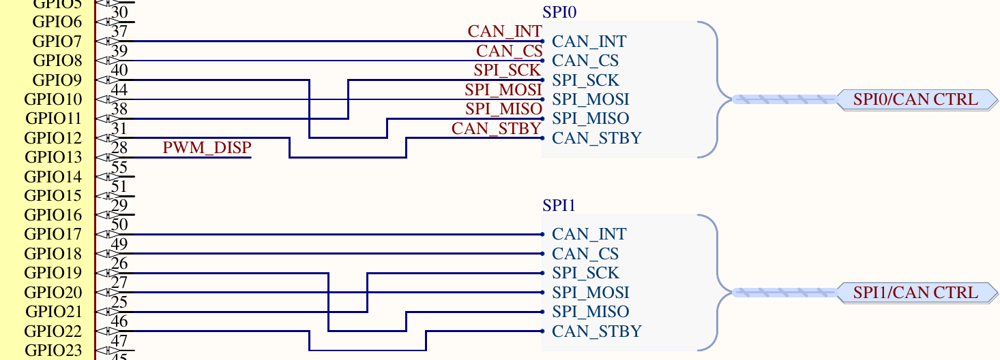

# CAN Bus Configuration

## SocketCAN Kernel Modules

Most CAN bus drivers in Linux are implemented via the SocketCAN interface. This interface is exposed via the `can`, `can_dev`, and `can_raw` kernel modules. In order to use the SocketCAN interface, said kernel modules must either be statically linked into the kernel during compilation or dynamically loaded into the kernel at runtime. Fortunately, the kernel distributed with the base RPi OS image appears to have these modules included by default.

## Electrical Configuration

Electrically, the DART's CAN interface is implemented using the MCP25625 integrated circuit. This IC is a combination CAN controller and CAN transceiver, meaning it allows devices to directly connect to a CAN bus via its SPI interface.

While the Linux kernel does not implement a device driver for the MCP25625 specifically, it does implement a driver for the MCP2515, which, from the processor's perspective, is functionally equivalent.

To enable this driver, the Linux kernel must be both informed the device *should* be enabled and informed about *how* to enable the driver. This is done by enabling the appropriate overlay in the kernel's device tree.

For the MCP25625 (or rather, the MCP2515 device tree overlay) there are 4 main properties that must be specified:
- The speed of the MCP25625's external oscillator
- The GPIO pin controlling the chip select of the MCP25625
- The GPIO pin tied to the interrupt output of the MCP25625
- The SocketCAN device name to assign the controller (ex. `can0`)

This information can be gathered from the DART's schematic:



The MCP25625 is connected to the ECS-160-20-3X-TR oscillator, this is a 16MHz oscillator.



CAN Bus 0 Controller (`can0`) Configuration:

MCP25625 Pin | CM5 Pin              | Description
-------------|----------------------|---------------------------
SCK          | GPIO 11 (SPI 0 SCK)  | SPI serial clock pin
MOSI         | GPIO 10 (SPI 0 MOSI) | SPI master-out / slave-in
MISO         | GPIO 9 (SPI 0 MISO)  | SPI master-in / slave-out
CS           | GPIO 8               | SPI chip select
INT          | GPIO 7               | MCP25625 interrupt pin

CAN Bus 1 Controller (`can1`) Configuration:

MCP25625 Pin | CM5 Pin              | Description
-------------|----------------------|---------------------------
SCK          | GPIO 21 (SPI 1 SCK)  | SPI serial clock pin
MOSI         | GPIO 20 (SPI 1 MOSI) | SPI master-out / slave-in
MISO         | GPIO 19 (SPI 1 MISO) | SPI master-in / slave-out
CS           | GPIO 18              | SPI chip select
INT          | GPIO 17              | MCP25625 interrupt pin

## Software Configuration

### Device Tree Overlay

The `/boot/firmware/config.txt` file is used to enable the desired device tree overlays. For the DART's configuration, the below lines can be appended to the end of this file:

```
# Enable the MCP25625 on SPI 0 (CS 8) as can0. Oscillator is 16MHz, interrupt
# pin is GPIO 7, chip select is GPIO 8.
dtoverlay=mcp2515-can0,oscillator=16000000,interrupt=7,cs=8

# Enable the MCP25625 on SPI 1 (CS 18) as can1. Oscillator is 16MHz, interrupt
# pin is GPIO 17, chip select is GPIO 18.
dtoverlay=mcp2515-can1,oscillator=16000000,interrupt=17,cs=18
```

Enabling these overlays unfortunately isn't enough to get the CAN interfaces working. The Compute Module's default SPI device tree overlay reserves GPIO 7 and GPIO 17 for chip select pins, however our configuration requires these pins for external interrupts. This contention results in the MCP2515 driver failing.

### Modifying SPI Chip Select Pins

In order to free GPIO 7 and GPIO 17 for external interrupts, we must create a custom device tree overlay to configure the SPI hardware as desired. The process for creating and using this overlay is detailed here, however this information has been summarized from the below URL:

https://gist.github.com/mcbridejc/d060602e892f6879e7bc8b93aa3f85be

The custom overlay begins with a device tree source file. This file TODO(Barach)...

## Debugging

If the MCP25625 fails to initialize for any reason, the associated `can0` or `can1` device will not appear during runtime. To determine the issue, the `dmesg` command can be used to get the kernel's output buffer. Error and warnings thrown by device drivers will appear in here, so the problem should become apparent by reading through this.

To sort through the many lines in this buffer, the `grep` command can be very useful. Some of the below commands can be used to try and filter out errors specific to the MCP25625.

```
sudo dmesg | grep -iF "mcp"
sudo dmesg | grep -iF "can"
sudo dmesg | grep -iF "failed"
```

Failure can be due to either electrical issues or an incorrect software configuration. When making changes to the software configuration, it is important to thoroughly track exactly what changes are being made and to do said changes incrementally.

When in doubt, consider making the exact same changes on another device that is known to work to determine whether it is the hardware or software being problematic (while still being able to revert said changes).