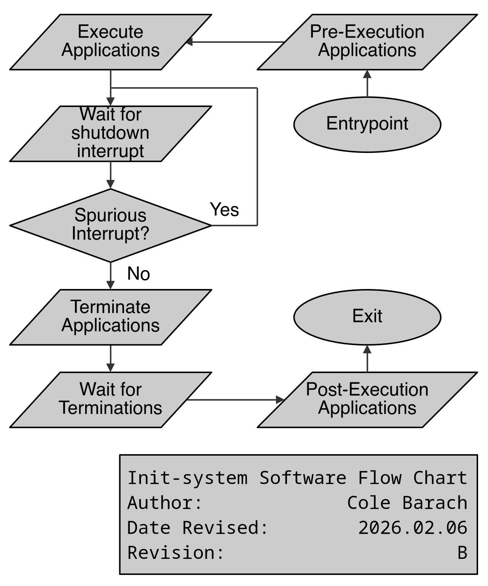

# The Init-System Application

The init-system is responsible for integrating both the GUI and the data logging applications. The main goal of the init-system is to launch said applications when the device boots and terminate said applications when the system is powering down.

The source code for the init-system application can be found at

[../src/init_system/main.c](../src/init_system/main.c)

## Control Flow

Upon starting, the init-system first executes the pre-execution application. This application (or shell script) is intended to perform and required initialization or configuration that must be done before the main applications are started. The init-system will wait for this application to naturally terminate before executing any of the main applications.

- For the DART, the pre-execution application is responsible for bringing the device's CAN interfaces online.

After the pre-execution application exits, the main applications are started. Each application is expected to run until the termination signal is sent, so the init-system does not wait for these applications. If an application does exit early (within ~10ms of being started) a warning will be printed.

- For the DART, the main applications are the data logging application (`can-mdf-logger`) and the dashboard application (`dashboard-gui`).

Upon detecting the device's shutdown, the init-system terminates all of the main applications and executes the post-execution application. This application is responsible for any necessary cleanup.

- For the DART, the post-execution application shuts down the operating system.

A diagram summarizing the control flow of the init-system is provided below:



### Specifying Application Arguments

As the init-system does not accept any arguments to provide the pre-execution application or the main applications, a workaround must be used for applications requiring arguments. The simplest workaround is to execute a shell script in place of the application.

Note that when doing this, it is not enough to invoke the application normally (like a command), as this does not allow the application to receive the termination signal sent by the init-system. Instead, the `exec` command must be used, which replaces the shell executing the script with the application itself. This means all signals delivered are delivered directly to the application, not the executing shell.

For example:
```
#!/bin/sh

# Note: Do not forget the 'exec' command. This command replaces the current shell instance with the process to execute, meaning
# all received signals are forwarded to the new process.
exec application-name arg1 arg2 ...
```

See the `exec(1p)` man page for more info:

https://www.man7.org/linux/man-pages/man1/exec.1p.html

## Shutdown Sequence

The biggest difference between the DART's init-system and a normal OS's init-system is the shutdown sequence. The data logging application is sensitive to unexpected system shutdowns due to the fact it works with files. To prevent corruption and data loss, the data logger must be terminated before the system powers down. This early termination is the performed by the DART's init-system.

The shutdown sequence is signaled via the power input subsystem of the DART's hardware. This software is non-portable, hence the need to isolate this functionality in the init-system.

When the device loses power, a comparator detects this and pulls the power status signal low. This transition from the high state to low state is what the init-system must detect.

TODO(Barach): Add schematic image once complete

### Permissions

By default, non-root users do not have access to the `gpiochip` devices. To grant a user permission to system devices, a group must be created to control this access. Any user added to said group will have read/write access as specified by the group's access.

The below commands will create a new group to be granted gpio access (named `gpio`) and add the user `zre` to said group.

```
sudo groupadd -r gpio
sudo usermod -aG gpio zre
```

The `/etc/udev/rules.d` directory contains the rules files of the system. These files define rules for device access. By creating a new file in here, the rules for the `gpiochip` device can be modified to allow access to the `gpio` group.

In file `/etc/udev/rules.d/60-gpio.rules`
```
# TODO(Barach): Docs
SUBSYSTEM=="gpio", KERNEL=="gpiochip[0-4]", GROUP="gpio", MODE="0660"
```

Referenced from: https://www.udoo.org/forum/threads/gpio-permissions-for-libgpiod-sudo-or-not.32453/